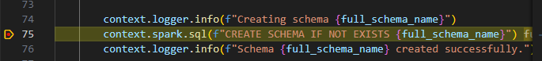
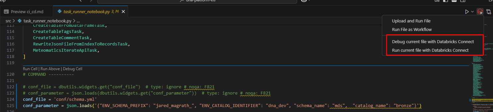

=========================
Task Runner Framework
=========================

The task runner framework is the name of this config-driven approach for
ETL/ELT.

-  The entrypoint for the framework is in
   ``src/data_platform/task_runner.py``.
-  The framework by defining a generic set of classes (Tasks) that
   perform unit ETL operations
-  You can pass objects to other classes using the Task Context.
-  Configuration on the sequence of tasks is defined in yaml, and will
   contain any additional configuration options for the task. This
   config lives in
   ``resources/source/<source>/templates/<prefix>_<source>_<config>_template.yaml``
   or
   ``resources/data_product/<product>/templates/<prefix>_<product>_<config>_template.yaml``
   Example:

.. code:: yaml

   tasks:
     1: # order of task
       task_name: SimpleBatchFileReaderTask # task name
       _format: csv # Config for SimpleBatchFileReaderTask
       path: !ENV s3://my_bucket/xyz/${TABLE_NAME} # Config for SimpleBatchFileReaderTask - Note here we use !ENV yaml tagging. See below for more details
       df_key: df # Config for SimpleBatchFileReaderTask - this object gets passed into the context to be used later
       df_namespace: example # Config for SimpleBatchFileReaderTask - this object gets passed into the context to be used later
       reader_options: # Config for SimpleBatchFileReaderTask
         header: true # Config for SimpleBatchFileReaderTask
     2: # 2nd order of task
       task_name: SimpleBatchWriterTask # task name
       df_key: df # Config for SimpleBatchWriterTask - this object is retrieved from the context
       df_namespace: example # Config for SimpleBatchWriterTask - this object is retrieved from the context
       _format: delta # Config for SimpleBatchWriterTask
       output_mode: overwrite # Config for SimpleBatchWriterTask
       table_name: !ENV ${TABLE_NAME} # Config for SimpleBatchWriterTask
       schema_name: !ENV ${ENV_SCHEMA_PREFIX}${SCHEMA_NAME} # Config for SimpleBatchWriterTask
       catalog_name: hive_metastore # Config for SimpleBatchWriterTask

-  You can parametrise the config file using the ``!ENV`` yaml tag.

   -  This parameter is then passed in at runtime using the command line
      argument
      ``--conf-parameter '{"TABLE_NAME": "example", "SCHEMA_NAME": "myschemaname"}``
   -  if the parameter is not found in –conf-parameter, it is fetched
      from the environment variables, which are set in
      ``databricks.yml``
   -  if the parameter is still not found in the environment variables,
      the parameter is replaced by itself, i.e. ``${ENV_SCHEMA_PREFIX}``
      will be replaced with ``ENV_SCHEMA_PREFIX``.

There is also a schema specific configuration of tasks, which handles
schema creation etc. This can be found in ``conf/schema.yml``. To use
this, pass in the relevant conf-file-parameters when specifying this
config file.

Defining Jobs with Task Runner
------------------------------

Generally speaking, databricks jobs for all layers will contain 2 steps.

1. Schema creation
2. ETL for tables

These should follow the pattern

.. code:: mermaid

   graph LR;
       schema_creation-->ETL_table_1;
       schema_creation-->ETL_table_2;
       schema_creation-.->...;
       schema_creation-.->ETL_table_n;

i.e. the ETL tasks should depend on schema creation. In practice, this
results in a job.yml file looks like the following for 2 example tables:

.. code:: yaml

   resources:
     jobs:
       silver_example: # name of the job
         name: silver_example_${bundle.target} # databricks job name
         tasks:
           - task_key: example_schema # schema_creation task
             job_cluster_key: job_cluster # define cluster this runs on
             python_wheel_task:
               package_name: data_platform # run the data_platform package
               entry_point: etl # etl entrypoint
               parameters: [
                   "--conf-file",
                   "${workspace.root_path}/files/resources/general/schema_creation/templates/schema_template.yaml", # specify the schema.yml as the conf file
                   "--conf-parameter", # pass in the relevant conf-file-parameters as json
                   '{
                   "ENV_CATALOG_IDENTIFIER": ${var.ENV_CATALOG_IDENTIFIER}
                   "ENV_SCHEMA_PREFIX": ${var.ENV_SCHEMA_PREFIX},
                   "CATALOG_NAME": silver
                   "SCHEMA_NAME": example,
                   }',
                 ]
             libraries:
               - whl: ../../../../dist/*.whl # install data_platform wheel on job cluster

           - task_key: example_etl # table etl
             depends_on:
               - task_key: example_schema # depends on schema creation
             job_cluster_key: job_cluster
             python_wheel_task:
               package_name: data_platform
               entry_point: etl
               parameters: [
                   "--conf-file",
                   "${workspace.root_path}/files/resources/*/*/templates/example.yaml", # pass in custom etl config for the given datasource.
                   "--conf-parameter", # pass in any conf file parameters as json
                   '{
                   "SCHEMA_NAME": "example",
                   "TABLE_NAME": "example_1"
                   }',
                 ]
             libraries:
               - whl: ../../../dist/*.whl # install data_platform wheel on job cluster

           - task_key: example_etl_2 # table etl
             depends_on:
               - task_key: example_schema # depends on schema creation
             job_cluster_key: job_cluster
             python_wheel_task:
               package_name: data_platform
               entry_point: etl
               parameters: [
                   "--conf-file",
                   "${workspace.root_path}/files/resources/*/*/templates/example.yaml", # pass in custom etl config for the given datasource.
                   "--conf-parameter", # pass in any conf file parameters as json
                   '{
                   "SCHEMA_NAME": "example",
                   "TABLE_NAME": "example_2"
                   }',
                 ]
             libraries:
               - whl: ../../../dist/*.whl # install data_platform wheel on job cluster

         job_clusters: # define the job cluster
           - job_cluster_key: job_cluster
             new_cluster:
               node_type_id: r5d.large # specify what instance to use
               runtime_engine: PHOTON
               num_workers: 1
               spark_version: 14.3.x-scala2.12 # specify what spark version to use
               spark_env_vars: # pass in the ENV as an environment variable, from there vars/{ENV}.yaml will be read and applied
                 ENV: ${bundle.target}

Debug Task Runner Framework
~~~~~~~~~~~~~~~~~~~~~~~~~~~

Before you begin, please review the `task_runner_framework.md
documentation <https://github.com/axpo-ts/dna-platform-etl/blob/develop/docs/task_runner_framework.md>`__
for additional context.

To debug the Task Runner, follow these steps in the
``src/task_runner_notebook.py`` file: 1. **Set the
``SPARK_CONNECT_LOG_LEVEL`` ENV variable:**
\`\`\ :literal:`SPARK_CONNECT_LOG_LEVEL=info     ```` 2. **Disable Widget Inputs:**    Comment out the lines that use`\ dbutils.widgets.get\ ``to retrieve``\ conf_file\ ``and``\ conf_parameter\`
at the top of the file

2. **Set Static Configuration:** Manually assign the desired values to
   ``conf_file`` and ``conf_parameter`` to be passed to
   ``etl_job._read_config`` method.

Below is an example for configuring the creation of a schema:

.. code:: python

   # Disable dynamic widget inputs:
   # conf_file = dbutils.widgets.get("conf_file")  # type: ignore # noqa: F821
   # conf_parameter = json.loads(dbutils.widgets.get("conf_parameter"))  # type: ignore # noqa: F821

   # Set static configuration for debugging in your personal dev env.
   conf_file = 'conf/schema.yml'
   conf_parameter = json.loads('{"ENV_SCHEMA_PREFIX": "jared_magrath_", "ENV_CATALOG_IDENTIFIER": "dna_dev", "schema_name": "mds", "catalog_name": "bronze"}')

if you want to debug it it locally with vscode with databricks connect
follow the following example:

|alt text| |alt text| —

`Home <../README.md>`__

TODO



