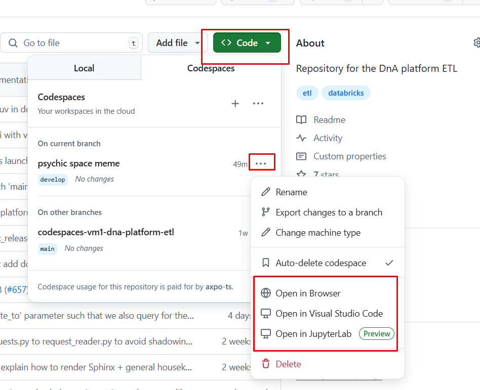
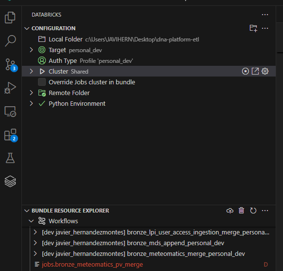

============
Installation & Development
============

Package Management
------------------

This project uses Python 3.12.X and
`PDM <https://pdm-project.org/latest/>`__.

GitHub Codespaces and Dev Containers
----------------------------
This project is configured to work with GitHub Codespaces.  This ensures that all developers have a consistent
development environment. It uses a dev container that includes all necessary dependencies and tools.

In order to use this feature, you need to have a GitHub account and access to the repository.
You can open the repository in a Codespace by clicking the "Code" button on the repository page and selecting "Open with Codespaces".
The first time you will need to create a new Codespace. You can then open it in Codespace (install the Codespace extension in VSCode).

After opening the Codespace, you can start developing immediately. The dev container will be built automatically.
   1. Make sure the dependencies are installed by running:

      .. code:: bash

         source .venv/bin/activate
         pdm install -G:all

   2. Use VSCode’s “Python: Select Interpreter” to use
      ``.venv/bin/python`` so your IDE uses the same python runtime as
      the virtualenv.

   3. Install pre-commit hooks into your git client:

      .. code:: bash

         pre-commit install

   4. You can now run the project, run tests, and use the dev container as your development environment.

      .. code:: bash

         pdm run lint

Local Environment Setup
-----------------------
It’s recommended to use a python version manager such as
`pyenv <https://github.com/pyenv/pyenv>`__.

1. Dev Container Setup (Recommended Approach for Mac users)

   0. Clone the repository:

      .. code:: bash

         # https method
         git clone https://github.com/axpo-ts/dna-platform-etl.git
         # ssh method. Make sure you have your SSH keys set up
         git clone git@github.com:axpo-ts/dna-platform-etl.git

   1. Open the project in a dev container. You can use the “VSCode
      Rebuild and Reopen in Container”. This should create the same
      environment for everyone, and install all development dependencies
      (including pre-commit hooks).

   2. In the terminal, switch to the local environment:

      .. code:: bash

         source .venv/bin/activate

   3. Use VSCode’s “Python: Select Interpreter” -> ``.venv/bin/python``

   4. If dev containers is not working properly, follow the steps below to
      set up the environment manually.

2. Non Container based approach using local workstation. This guide is
   assuming a Unix/Windows based OS (Recommended Approach for Windows
   users):

   You will need to have installed the following tools:
     - `Git <https://git-scm.com/downloads>`__
     - `PDM <https://pdm-project.org/latest/>`__
     - `Azure CLI <https://learn.microsoft.com/en-us/cli/azure/install-azure-cli>`__
     - `Databricks CLI <https://learn.microsoft.com/en-us/azure/databricks/dev-tools/cli/install>`__

   The examples below assume you are using Windows PowerShell:

   0. Clone the repository.

      .. code:: bash

         # https method
         git clone https://github.com/axpo-ts/dna-platform-etl.git
         # ssh method. Make sure you have your SSH keys set up
         git clone git@github.com:axpo-ts/dna-platform-etl.git

   1. Ensure you have python 3.12.x, pip and git installed for your
      operating system.

   2. Install PDM see `here for all installation
      methods <https://pdm-project.org/latest/#installation>`__

      Install within python env using pip.

      .. code:: powershell

         pip install --user pdm

      (optional) If you want to install PDM globally, you can:

      .. code:: powershell

         powershell -ExecutionPolicy ByPass -c "irm https://pdm-project.org/install-pdm.py | python -"

   2. Create a venv with python 3.12.x:

      .. code:: powershell

         pdm venv create --name dna_platform 3.12
         pdm venv activate

   3. Install Azure CLI see `here for all installation
      methods <https://learn.microsoft.com/en-us/cli/azure/install-azure-cli>`__

      .. code:: powershell

         winget install --exact --id Microsoft.AzureCLI

   4. Install Databricks CLI see `here for all installation
      methods <https://learn.microsoft.com/en-us/azure/databricks/dev-tools/cli/install>`__

      .. code:: powershell

         winget search databricks
         winget install Databricks.DatabricksCLI

   5. Instantiate a local python environment using PDM. This will create
      a virtualenv under “.venv” for you:

      .. code:: powershell

         pdm install -G:all

   6. Use VSCode’s “Python: Select Interpreter” to use
      ``dna_platform`` so your IDE uses the same python runtime as
      the virtual env.

   7. Install pre-commit hooks into your git client:

      .. code:: powershell

         pre-commit install

Configuring Databricks and Using Databricks Asset Bundles
---------------------------------------------------------

1. Authenticate to your Databricks workspace. Ensure you have a
   Databricks token allowing you to have CLI access:

   -  Create a token Databricks > Click your users icon on top right of
      page > Settings > Developer > Access Tokens > Manage > Generate
      new token
   -  In VS Code, run:

   .. code:: bash

      databricks configure --token

   -  For URL, enter workspace URL (copy from your browsers address bar,
      it should look a similar format to this:
      ``https://adb-4027174922259360.0.azuredatabricks.net/``)
   -  For Token, enter the generated access token

2. To deploy a development copy of this project, type:

   .. code:: bash

      databricks bundle deploy --target personal_dev

   (Note that “dev” is the default target, so the ``--target`` parameter
   is optional here.)

   .. code:: bash

      databricks bundle deploy --target personal_dev --profile dev

   (Note that “personal_dev” is the default target, so the ``--target``
   parameter is optional here, targets are configured in databricks.yml
   in the root of the repo)

   This deploys everything that’s defined for this project. You can find
   that job by opening your workspace and clicking on **Workflows**.

3. To run a job or pipeline, head to the Workflow section in Databricks,
   locate your workflow and run it. The name of the workflow will have
   the following format:

.. code:: bash

      databricks bundle run

.. code:: bash

       [dev first_name last_name] workflow_name

4. To get your prefix running on all schemas, locate the following
   workflow in Databricks and run it:

   .. code:: bash

      [dev first_name last_name] orchestration_dev_personal_dev

5. For documentation on the Databricks asset bundles format used for
   this project, and for CI/CD configuration, see
   https://docs.databricks.com/dev-tools/bundles/index.html.

Note that all deployments beyond personal_dev should be done via Service
Principal, and should only be deployed as part of CI/CD.

Running Unit Tests
~~~~~~~~~~~~~~~~~~

For unit testing, use (to run all unit tests):

.. code:: bash

   pdm unit_test

To run only one unit test at a time, use the syntax:

.. code:: bash

   pdm unit_test absolute_file_path::test_name

for example, to run the test ``test_set_delta_load_parameters_task`` in
unit test file ``test_ingestion.py``, run:

.. code:: bash

   pdm unit_test ./tests/unit/test_ingestion.py::test_set_delta_load_parameters_task

Note that its recommended to run unit tests inside the dev container,
since this handles spark configuration.

Formatting and Linters
~~~~~~~~~~~~~~~~~~~~~~

In this project, we’re using:

-  `Ruff linter & Formatter <https://github.com/astral-sh/ruff>`__
-  `SQL Fluff for SQL <https://sqlfluff.com>`__
-  `MyPy Typechecker <https://mypy.readthedocs.io/en/stable/>`__

The PR pipeline executes ``pdm lint_check`` to verify code.

To run the linter locally, use:

.. code:: bash

   pdm lint

This both formats the code and performs the same linting checks as the
PR pipeline.

To run just formatting, use:

.. code:: bash

   pdm format

Deployment
----------

When code is pushed to any branch, the lint and test jobs will run.

When code is merged into ``develop``, jobs will be deployed to the
``dev`` and ``test`` databricks workspace.

When code is merged into ``main``, jobs will be deployed to the ``prod``
databricks workspace.

Configuring Databricks Connect in VSCode
----------------------------------------

Installing the Databricks extension in Visual Studio Code is highly
recommended. It provides a user-friendly interface for managing
workflows and facilitates local debugging:

   alt text

More information on how to set it up can be found
`here <https://learn.microsoft.com/en-us/azure/databricks/dev-tools/databricks-connect/python/vscode>`__.

Debug ETL Package
~~~~~~~~~~~~~~~~~~~~~~~~~~~
For the workflows that still use the ELT Package, follow the following documentation.
Before you begin, please review the `etl_package_guidelines.rst
documentation <https://github.com/axpo-ts/dna-platform-etl/blob/develop/docs/source/development/etl_package_guidelines.rst>`__
for additional context.

Debug Task Runner Framework
~~~~~~~~~~~~~~~~~~~~~~~~~~~
For the workflows that still use the Task Runner Framework, follow the following documentation.
Before you begin, please review the `task_runner_framework.rst
documentation <https://github.com/axpo-ts/dna-platform-etl/blob/develop/docs/source/development/task_runner_framework.rst>`__
for additional context.
